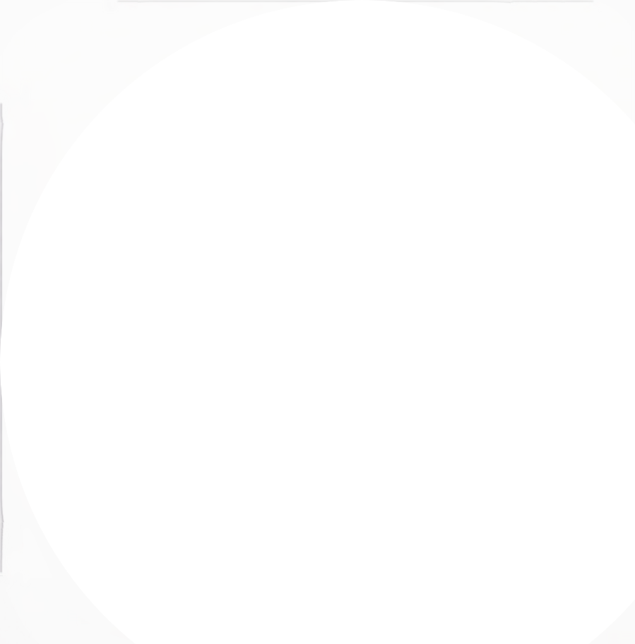

<div align="center">



# AniZen

### A personal anime & movie client for Android.
#### AniZen × Miyomi
*A custom media player built with Jetpack Compose, designed for fluid interactions, smart offline playback, and experimental integrations.*

[](https://discord.gg/J2wmZqEJnS)
[](https://github.com/salmanbappi/AniZen/actions/workflows/preview.yml)
[](https://github.com/salmanbappi/AniZen/releases)
[](/LICENSE)

</div>

---

## 📖 About AniZen

AniZen is a solo-built passion project that started on the foundation of Aniyomi and Anikku. It was created to explore how far an Android media client can go when designed with modern programming principles, deep player optimizations, and a focus on fluidity. 

It aims to offer a premium, responsive, and completely personalized viewing space while remaining lightweight and respectful of hardware resources.

---

## Features

<div align="left">

### Features include:

* **AniZen**:
  * `Anime4K Neural Shaders` built-in upscaling presets (Fast, Anime, Cinematic, High) for real-time video upscaling.
  * `Motion Interpolation` custom shaders generating smooth frames up to 60fps.
  * `MPVFX Filter Suite` card-based interface in the player for Debanding, Blur, Sharpen, and custom shader configurations.
  * `Dynamic Mediacodec Switching` automatic fallback to software decoding if active filters exceed hardware capability.
  * `Fluid Playback Gestures` long-press to activate jitter-free 2x speed with release animation, and horizontal slide speed adjustments.
  * `1DM-Style Downloader` multi-threaded chunked download engine utilizing byte-range splitting.
  * `Resilient Part-File Recovery` per-part download integrity checks, automatic 5x retry logic, and dynamic buffer sizing (32KB/64KB/128KB).
  * `Content-Type Verification` automatic validation of incoming stream headers to prevent HTML/text files masquerading as videos.
  * `Infrastructure Command Center` operational network dashboard showing BDIX server status, live node latency, and CDN Reliability Index.
  * `Behavioral Watch Statistics` interactive profiling charts (radar, pie, bar) tracking genre focus, temporal viewing patterns, and source reliability.
  * `AI Diagnostics & Assistant` conversational troubleshooting assistant capable of digesting exception trace logs and library context.
* **Anikku**:
  * `Anime Suggestions` automatically showing source-website's recommendations / suggestions / related to current entry for all sources.
  * `Auto theme color` based on each entry's cover for entry View & Reader.
  * `App custom theme` with `Color palettes` for endless color lover.
  * `Bulk-favorite` multiple entries all at once.
  * `Fast browsing` (for who with large library experiencing slow loading)
  * Auto `2-way sync` progress with trackers.
  * Support `Android TV`, `Fire TV`.
  * From SY:
    * `Anime Recommendations` showing community recommends from Anilist, MyAnimeList.
    * Edit `Anime Info` manually, or fill data from MyAnimeList, Kitsu, Shikimori, Bangumi, Simkl.
    * `Custom cover` with files or URL.
    * `Feed tab`, where you can easily view the latest entries or saved search from multiple sources at same time.
    * `Saving searches` & filters, can use them with `Feed-tab`
    * `Pin anime` to top of Library with `Tag` sort.
    * `Merge anime` allow merging separated anime/episodes into one entry.
    * `Lewd filter`, hide the lewd anime in your library when you want to.
    * `Tracking filter`, filter your tracked anime so you can see them or see non-tracked anime.
    * `Search tracking` status in library.
    * `Mass-migration` all your anime from one source to another at same time.
    * `Dynamic Categories`, view the library in multiple ways.
    * `Custom categories` for sources, liked the pinned sources, but you can make your own versions and put any sources in them.
    * Cross device `Library sync` with SyncYomi & Google Drive.
  * Anime `cover on Updates notification`.
  * `Panorama cover` showing wide cover in full.
  * `to-be-updated` screen: which entries are going to be checked with smart-update?
  * `Update Error` screen & migrating them away.
  * `Source & Language icon` on Library & various places.
  * `Grouped updates` in Update tab.
  * Drag & Drop re-order `Categories`.
  * Ability to `enable/disable repo`, with icon.
  * `Search for sources` & Quick NSFW sources filter in Extensions, Browse & Migration screen.
  * In-app `progress banner` shows Library syncing / Backup restoring / Library updating progress.
  * Long-click to add/remove single entry to/from library, everywhere.
  * Docking Watch/Resume button to left/right.
  * Auto-install app update.
  * Configurable interval to refresh entries from downloaded storage.
* **Aniyomi**:
  * Watching videos
  * Local watching of downloaded content
  * A configurable player built on mpv-android with multiple options and settings
  * Tracker support: MyAnimeList, AniList, Kitsu, Simkl, Shikimori, and Bangumi
  * Categories to organize your library
  * Create backups locally to watch offline or to your desired cloud service
* **Other forks' features**:
  * Torrent support (Needs right extensions)
  * Support for Cast functionality
  * Group by tags in library
  * Discord Rich Presence

</div>

---

## 🛠️ Technical Architecture

AniZen follows **Clean Architecture** principles to separate business logic, UI, and data handling into a modular structure:

```
app                   # Entry point, dependency injection configuration
├── core              # Shared helpers, common extensions, and base utilities
├── data              # Repositories, database (SQLDelight), and networking (OkHttp)
├── domain            # Core business logic, use cases, and domain models
├── presentation-core # Reusable UI components, themes, and design tokens (Compose)
├── source-api        # Extension API interfaces and definitions
└── source-local      # Local storage and media indexers
```

### Technical Stack & Decisions
*   **Development Platform:** 100% Kotlin with Jetpack Compose for declarative UI.
*   **Concurrency:** Kotlin Coroutines & Flow for asynchronous tasks and state streaming.
*   **Database:** SQLDelight for compile-time safe SQL queries.
*   **Core Shaders:** High-quality `ewa_lanczossharp` scaling for sharpest anime lines.
*   **Scrolling Performance:** Implements `Precision.INEXACT` cover scaling to delegate image processing to the GPU, removing micro-stutter and keeping scrolling fluid on 120/144Hz displays.

---

## 🚀 Getting Started

### For Users
1. Head over to the [Releases](https://github.com/salmanbappi/AniZen/releases) tab.
2. Download the latest `arm64-v8a` release APK.
3. Install the APK (requires enabling *Install from Unknown Sources*).
4. Installs under package ID `app.anizen` — runs side-by-side with official Anikku without issues.

### For Developers
Clone the repository and build using Gradle:
```bash
git clone https://github.com/salmanbappi/AniZen.git
cd AniZen
./gradlew assembleDebug
```
Automated preview builds can also be found in the [Actions tab](https://github.com/salmanbappi/AniZen/actions/workflows/preview.yml).

---

## 🤝 Contributing & Support

*   **Bug Reports:** Report issues and attach logs via [GitHub Issues](https://github.com/salmanbappi/AniZen/issues).
*   **Community:** Join our [Discord Server](https://discord.gg/J2wmZqEJnS) to ask questions, chat, or suggest features.

---

## 💖 Credits

AniZen would not be possible without the incredible open-source projects it builds upon:
*   [Aniyomi](https://github.com/aniyomiorg/aniyomi) & [Anikku](https://github.com/komikku-app/anikku) (Core codebase foundations)
*   [Anime4K](https://github.com/bloc97/Anime4K) (Real-time shaders)
*   [mpvEx](https://github.com/marlboro-advance/mpvEx) (MPV integration patterns)

---

## 📄 License

AniZen is open-source software licensed under the [Apache-2.0 License](LICENSE).

---

<div align="center">
<sub>AniZen × Miyomi</sub><br>
<sub>Designed, directed, and built solo. Every detail intentional.</sub>
</div>
